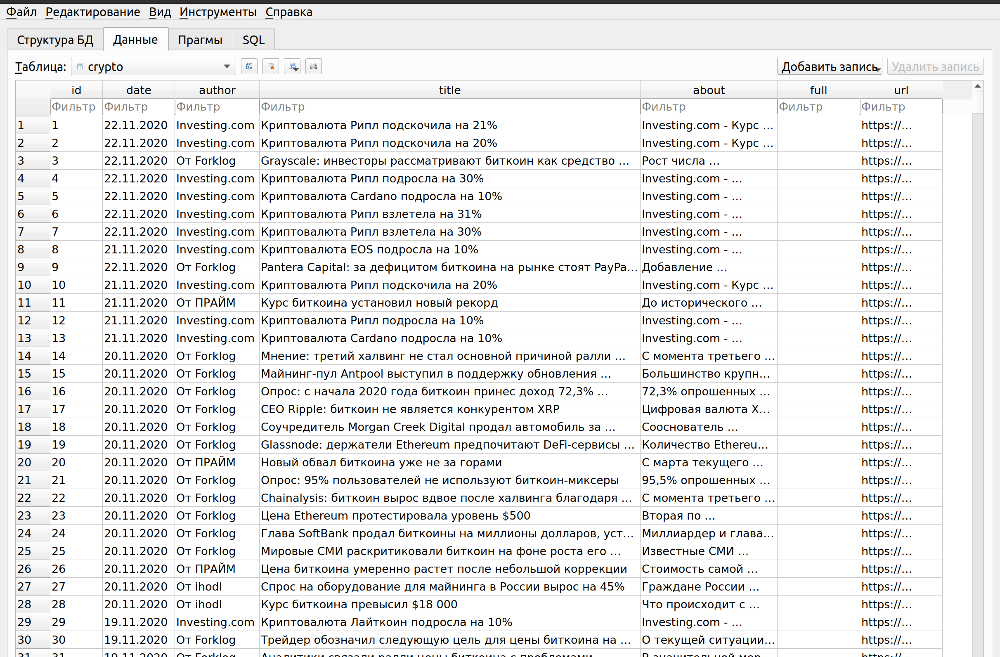
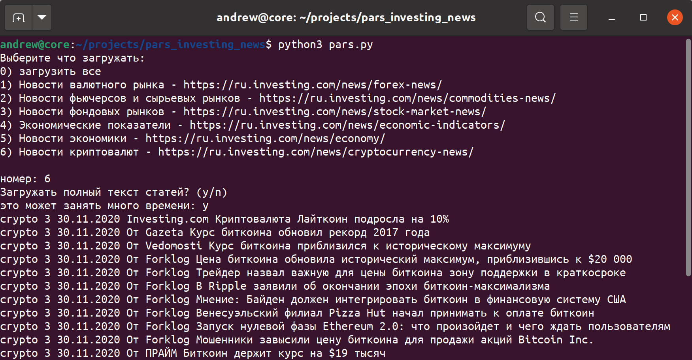

# Парсер новостей с сайта investing.com
*Инструмент для исследователей, который позволяет загрузить историю новостей по различным направлениям, новости экономики, криптовалюты, фондовых рынков и т.д., с целью дальнейшего анализа.*

# Что и как выкачивает

Парсер постранично проходит по выбранной ссылке, собирая следующую информацию:

- дата публикации
- автор
- заголовок
- подробности
- полный текст статьи (будет добавлено позже)
- ссылка на статью



# Как использовать

Для установки нужных библиотек выполните `pip3 install -r requirements.txt`

Работает из командной строки:

```bash
python3 pars.py
```



После выбора начнется загрузка в sqlite базу данных `investing.sqlite`

Скрипт остановится по достижении последней страницы.

Так же есть возможность остановить скрипт и запустить его позже, загрузка продолжится с места остановки.


P.S. На момент написания скрипта количество скачанных данных было таким:

- https://ru.investing.com/news/forex-news/ 65130 новости 2010-2020гг.
- https://ru.investing.com/news/commodities-news/ 30512  новости 2010-2020гг.
- https://ru.investing.com/news/economic-indicators/ 34642  новости 2010-2020гг.
- https://ru.investing.com/news/stock-market-news/ 86530 новости 2010-2020гг.
- https://ru.investing.com/news/economy/ 162357 новости 2014-2020гг.
- https://ru.investing.com/news/cryptocurrency-news/ 2502 новости 2011-2020гг.

